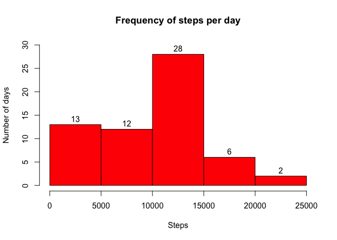
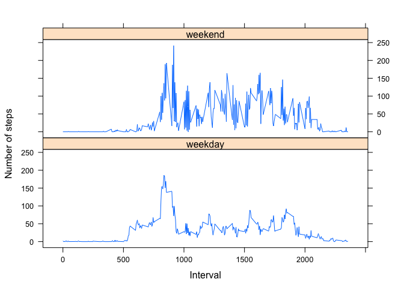

# Reproducible Research: Peer Assessment 1
Author: gutierro  


### Data

The data for this assignment can be downloaded from the course web site: 

* **Dataset:** [Activity monitoring data](https://d396qusza40orc.cloudfront.net/repdata%2Fdata%2Factivity.zip) [52K]

The variables included in this dataset are:

* **steps:** Number of steps taking in a 5-minute interval (missing values are coded as NA)

* **date:** The date on which the measurement was taken in YYYY-MM-DD format

* **interval:** Identifier for the 5-minute interval in which measurement was taken

The dataset is stored in a comma-separated-value (CSV) file and there are a total of 17,568 observations in this dataset.  


### 1. Loading and preprocessing the data

```r
library("dplyr")
activity.df <- read.csv("activity.csv")
```


### 2. What is mean total number of steps taken per day?


#####2.1 Make a histogram of the total number of steps taken each day


```r
df<-activity.df %>% 
        group_by(date) %>% 
        summarise(total_steps=sum(steps,na.rm=TRUE))

hist(df$total_steps, main="Frequency of steps per day",
     xlab="Steps", ylab="Number of days", col="Red", labels=TRUE, ylim=c(0,30))
```

 


#####2.2 Calculate and report the mean and median total number of steps taken per day

```r
mean(df$total_steps)
```

```
## [1] 9354.23
```

```r
median(df$total_steps)
```

```
## [1] 10395
```

###3. What is the average daily activity pattern?

#####3.1 Make a time series plot (i.e. `type = "l"`) of the 5-minute interval (x-axis) and the average number of steps taken, averaged across all days (y-axis)


```r
df<-activity.df %>% 
        group_by(interval) %>% 
        summarise(avg_steps=mean(steps,na.rm=TRUE))
df%>%
        plot(type = "l", main = "Steps average across all days by interval" , ylab="Steps (avg)", xlab="Interval")
```

 


#####3.2 Which 5-minute interval, on average across all the days in the dataset, contains the maximum number of steps?

```r
df$interval[which.max(df$avg_steps)]
```

```
## [1] 835
```

###4. Imputing missing values

#####4.1 Calculate and report the total number of missing values in the dataset by column (i.e. the total number of rows with NAs)

```r
colSums(is.na(activity.df))
```

```
##    steps     date interval 
##     2304        0        0
```

#####4.2 Devise a strategy for filling in all of the missing values in the dataset. The strategy does not need to be sophisticated. For example, you could use the mean/median for that day, or the mean for that 5-minute interval, etc.

In the previous step we can observed that only the steps valiable has `NA` values. Be cause it is an integer we can replace the `NA` by 0

#####4.3 Create a new dataset that is equal to the original dataset but with the missing data filled in.

```r
df<-activity.df %>% 
        group_by(interval) %>% 
        summarise(avg_steps=mean(steps,na.rm=TRUE))

activity.clean.df <- merge(activity.df,df , by = "interval")
        
activity.clean.df<- activity.clean.df %>%
        mutate(steps = ifelse(is.na(steps),avg_steps,steps))
```

#####4.4 Make a histogram of the total number of steps taken each day and Calculate and report the mean and median total number of steps taken per day. Do these values differ from the estimates from the first part of the assignment? What is the impact of imputing missing data on the estimates of the total daily number of steps?

The missing data has quite an impact as we observe the difference the mean and median values in repect the first part.


```r
df2<-activity.clean.df %>% 
        group_by(date) %>% 
        summarise(total_steps=sum(steps))

hist(df2$total_steps, main="Frequency of steps per day",
     xlab="Steps", ylab="Number of days", labels=TRUE, ylim=c(0,35))
```

 

```r
mean(df2$total_steps)
```

```
## [1] 10766.19
```

```r
median(df2$total_steps)
```

```
## [1] 10766.19
```

###5. Are there differences in activity patterns between weekdays and weekends?
For this part the weekdays() function may be of some help here. Use the dataset with the filled-in missing values for this part.

#####5.1 Create a new factor variable in the dataset with two levels – “weekday” and “weekend” indicating whether a given date is a weekday or weekend day.

The package `date` and `lattice` are required for this part


```r
library("date")
```

```
## Warning: package 'date' was built under R version 3.1.2
```

```r
library("lattice")
activity.clean.df$wday<-ifelse(as.POSIXlt(activity.clean.df$date)$wday == c(0,6),"weekend","weekday")
```


#####5.2 Make a panel plot containing a time series plot (i.e. type = "l") of the 5-minute interval (x-axis) and the average number of steps taken, averaged across all weekday days or weekend days (y-axis). See the README file in the GitHub repository to see an example of what this plot should look like using simulated data.

```r
df2<-activity.clean.df %>% 
        group_by(interval,wday) %>% 
        summarise(avg_steps=mean(steps))

xyplot(avg_steps ~ interval | wday, df2, type = "l", layout = c(1, 2), 
       xlab = "Interval", ylab = "Number of steps")
```

 
